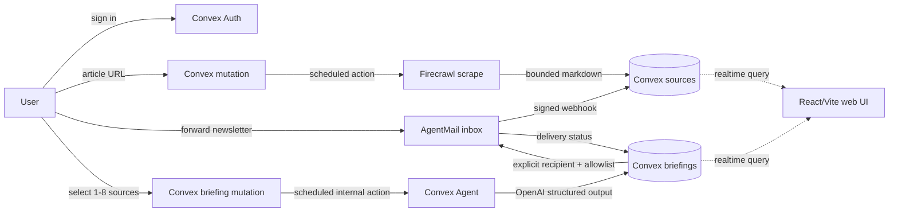

# Marginfield hackathon tooling

Marginfield is a new reading-and-briefing app for the Convex All Gas Hackathon. It
accepts public article URLs and forwarded newsletters, stores each user's
library, and turns one to eight ready sources into a source-linked briefing.
This document maps the hackathon requirements and the installed tools to the
code that uses them.

## Status vocabulary

| Status | Meaning for this project |
| --- | --- |
| **Installed** | The package is in `package.json` and `package-lock.json`. |
| **Registered** | A Convex component is mounted in `convex/convex.config.ts`. |
| **Implemented** | Application code calls the component or exposes the required route. |
| **Local-tested** | Tests, typechecking, build, or browser checks run against local code. |
| **Live-verified** | A configured development deployment completed a real provider round trip. |

The first four states are supported by this repository. **Live-verified is not
claimed:** no Convex deployment, provider account, public host, API key, email
delivery, or OpenAI request was used during this build. The default app without
`VITE_CONVEX_URL` is an explicitly labelled local preview. Preview briefings
use local sample excerpts; they do not impersonate Firecrawl, OpenAI, or
AgentMail.

## How the tools fit together



## Runtime tools and their real use

### Convex

**Installed:** `convex@1.46.0`.

**Used for:** the authenticated application backend, data ownership, live
queries, mutations, actions, scheduling, HTTP routes, quotas, and recovery
state. The schema is in [`convex/schema.ts`](../convex/schema.ts).

- `sources` stores owned articles, newsletters, and notes. It includes read and
  bookmark state, import status, bounded processing attempts, and deadlines.
- `briefings` stores an immutable source-ID selection, structured sections,
  generation attempts, deadlines, and email delivery state.
- `inboxes` binds an AgentMail inbox to one user.
- `providerEvents` deduplicates inbound webhook events.
- `mutationReceipts` makes explicit delivery attempts idempotent.
- `usageCounters` supports per-user and global daily limits.
- Auth tables are supplied by Convex Auth.

The public authenticated API is split into ordinary Convex functions:

- Queries: [`convex/library.ts`](../convex/library.ts),
  [`convex/briefings.ts`](../convex/briefings.ts), and
  [`convex/mail.ts`](../convex/mail.ts) return only the signed-in user's data.
- Mutations validate ownership, input bounds, source selection, quotas, and
  state transitions. Article import and briefing generation are queued with
  `ctx.scheduler.runAfter`.
- Actions call external services without exposing provider credentials to the
  browser. [`src/main.tsx`](../src/main.tsx) subscribes with Convex React
  hooks, so source and briefing changes can appear without a manual refresh.
- HTTP routes in [`convex/http.ts`](../convex/http.ts) add Convex Auth routes,
  the AgentMail webhook, and the static-hosting fallback.
- [`convex/crons.ts`](../convex/crons.ts) runs a one-minute stale-job watchdog.
  [`convex/jobs.ts`](../convex/jobs.ts) fails expired imports and generations.

#### Local backend evidence

The recorded local run covered six test files and 20 tests. The backend
evidence is specific rather than a provider-availability claim:

- [`tests/backend.access.test.ts`](../tests/backend.access.test.ts) checks
  bounded text, the eight-source cap, and stable UTC quota buckets.
- [`tests/backend.library.test.ts`](../tests/backend.library.test.ts) checks
  authenticated library isolation, cross-account read/bookmark/delete denial,
  partial state updates, and separate briefing/delivery quota counters.
- [`tests/backend.jobs.test.ts`](../tests/backend.jobs.test.ts) checks that the
  watchdog fails expired imports and generations but leaves fresh work active.
- [`tests/providers.test.ts`](../tests/providers.test.ts) checks public URL
  safety, bounded provider text, recipient policy, stable event keys, and the
  app-owned AgentMail inbound mutation's dedupe and unknown-inbox behavior.
- [`tests/briefing.test.ts`](../tests/briefing.test.ts) checks source ownership,
  readiness and bounds, JSON framing, malformed output, citation membership,
  and hostile source serialization.

These tests do not create a cloud deployment, call a provider, verify a signed
HTTP request, send an email, or prove production hosting.

### Convex Auth

**Installed:** `@convex-dev/auth@0.0.95`.

**Implemented:** password sign-in/sign-up through
[`convex/auth.ts`](../convex/auth.ts), Auth tables in the schema, and the
browser provider in [`src/main.tsx`](../src/main.tsx). The UI also has a local
preview path when no deployment URL is configured.

**Important boundary:** live auth setup, generated JWT/JWKS secrets, email
verification, recovery, and a production identity-provider review are not
verified. The connected delivery path therefore fails closed unless the
server-controlled recipient allowlist permits the destination. Auth v2 is an
optional current Convex resource, not a separate package or feature claimed by
this build.

### Firecrawl

**Installed:** `@firecrawl/firecrawl-convex@0.1.1`. **Registered:** under the
`/firecrawl/` component prefix in [`convex/convex.config.ts`](../convex/convex.config.ts).

**Implemented use:** one submitted public HTTP(S) article URL is passed to
`FirecrawlClient.scrape` from [`convex/ingestion.ts`](../convex/ingestion.ts),
requesting markdown and main content. This is **single-page extraction**, not
a whole-site crawl, RSS importer, or arbitrary browser fetch. URL validation
rejects credentials and private IP literals; fetched text and metadata are
bounded before storage. Import status is `queued → processing → ready` or
`failed`, with attempt-conditional completion and stale-job recovery.

**Local-tested:** URL validation and bounded text in
[`tests/providers.test.ts`](../tests/providers.test.ts), plus local source
state and watchdog tests in [`tests/backend.jobs.test.ts`](../tests/backend.jobs.test.ts).
The suite does not call Firecrawl. **Live-verified:** no;
`FIRECRAWL_API_KEY` and webhook secret were not read or configured for this
build.

### Convex Agent and OpenAI

**Installed:** `@convex-dev/agent@0.7.3`, `ai@7.0.109`, and
`@ai-sdk/openai@4.0.72`. **Registered:** the Agent component in
[`convex/convex.config.ts`](../convex/convex.config.ts).

**Implemented use:** [`convex/briefingActions.ts`](../convex/briefingActions.ts)
creates a source-linked Agent with `openai(modelName)`, where `modelName` is
`OPENAI_MODEL` or the documented default `gpt-5-mini`. The action sends a
bounded JSON frame containing the selected sources, requests structured output,
and validates it with the Zod schema in [`convex/briefingSafety.ts`](../convex/briefingSafety.ts).
Every returned citation must belong to the saved source snapshot. Source text
is treated as untrusted reference data and the Agent has no tools enabled.

**Local-tested:** prompt framing, maximum eight sources, malformed output,
citation membership, and hostile source text serialization in
[`tests/briefing.test.ts`](../tests/briefing.test.ts). **Live-verified:** no;
no OpenAI request was made. The preview generator is deterministic and is
explicitly labelled as not AI-generated.

AI Gateway is an optional Convex resource, not installed, registered, or used
by Marginfield. It must not be described as part of the implementation.

### AgentMail

**Installed:** `@agentmail/convex@0.1.0`. **Registered:** in
[`convex/convex.config.ts`](../convex/convex.config.ts).

**Implemented use** in [`convex/mail.ts`](../convex/mail.ts):

1. An authenticated user can create one owned inbox through the AgentMail
   component.
2. AgentMail calls the `/agentmail/webhook` HTTP route. The route requires the
   configured webhook secret and delegates signature verification to the
   component. The route itself has not been exercised against a signed HTTP
   request locally.
3. The app-owned inbound handler accepts only a registered inbox, atomically
   records an event/message dedupe key, and creates one newsletter source for
   that inbox's owner. Duplicate events and an unknown inbox ID do not create
   sources.
4. Sending is an explicit authenticated action from the UI. The recipient must
   pass the server-controlled `ALLOWED_DIGEST_RECIPIENT` policy. The send
   stores the provider outbound ID and starts as `queued`.
5. Delivery can be refreshed or reconciled into `sent`, `delivered`, `failed`,
   or `bounced`. A retry needs a new explicit attempt ID and is allowed only
   after a terminal failure.

**Local-tested:** provider URL/recipient/dedupe helpers and the app-owned
inbound mutation in [`tests/providers.test.ts`](../tests/providers.test.ts).
That test inserts one registered inbox, sends the same callback twice, and
checks that one newsletter is created; it also sends a callback for a missing
inbox and checks that it is ignored. It does **not** prove AgentMail signature
verification, outbound delivery, or provider status callbacks. **Live-verified:**
no; no inbox was created, no webhook was received, and no email was sent.

## Static hosting and submission surface

**Installed and registered:** `@convex-dev/static-hosting@0.2.1`. The HTTP
router mounts its static routes in [`convex/http.ts`](../convex/http.ts), and
`convex/convex.config.ts` mounts the component. The Vite production build
creates `dist/`.

This component remains configured for a future connected `convex.site` release. The public no-sign-in sample preview uses **Codex Sites** on `chatgpt.site` instead. This sample does not exercise the Convex backend or sponsor providers. A public sample URL and signed-out browser preview check now exist. A connected
Convex deployment, real provider round trips and submission remain open gates. No deployment command is run by `npm run build`.

## Build-time tools, not product integrations

The repository also contains the official project-local
[`convex-hackathon-skill`](../.agents/skills/convex-hackathon-skill/SKILL.md).
It maintains the evidence-based root [`hackathon.md`](../hackathon.md):
components are listed only when registered, unknown live facts remain
`not deployed`, and secrets or personal data are excluded. It is a build-time
documentation skill, not a runtime feature and not a sponsor integration.

The Convex CLI scripts in [`package.json`](../package.json) are developer
commands:

```text
npm run convex:dev       # connect a separately authorized development deploy
npm run convex:codegen   # regenerate deployment-aware API bindings
npm run typecheck
npm test
npm run build
```

The project-local Convex AI-file setup was completed with `npx convex ai-files
install` and `npx convex ai-files status`. It installed the managed
`convex/_generated/ai/guidelines.md` and state file, and the repository contains
the managed `AGENTS.md`, `CLAUDE.md`, and Convex skills under `.agents/` and
`.claude/`. These are build-time guidance files, not runtime integrations.

The existing callable `convex@openai-curated-remote` plugin (version 2.0.1)
was available to the build environment. This does not mean that an exact
`get-convex` marketplace plugin was installed; no such marketplace installation
is claimed here. Neither the plugin nor the AI-file command created a cloud
deployment.

The checked-in generated bindings allow local checks to run, but canonical
component-aware code generation needs an authorized configured development
deployment. This project has not claimed that cloud validation.

Codex, the product-design references, and the local image-generation workflow
helped create the visual direction and documentation. They do not execute in
the Marginfield runtime. No native Twine source or history is part of this project;
the visual reuse and generated assets are disclosed in
[`docs/provenance.md`](provenance.md).

## Requirement cross-check

The event page and project-local skill require more than source code: a new
project, public repository, public hosted app, root `hackathon.md`, short demo
video, social post with the required tags, and submission through the event
form. Marginfield has the new project structure, root log, responsive app, and
registered integrations. The following remain **not verified in this
repository**:

- public GitHub repository exists: https://github.com/emSoumik/marginfield;
- public `chatgpt.site` sample exists: https://marginfield-reader.soumikhalder.chatgpt.site;
- live connected Convex deployment and sponsor round trips;
- live Convex Auth, Firecrawl, OpenAI, and AgentMail round trips;
- public-host mobile and desktop smoke tests;
- demo video, social post, and form submission;
- organizer eligibility confirmation for any visual inspiration.

See [`docs/submission-checklist.md`](submission-checklist.md),
[`docs/release-gates.md`](release-gates.md), and [`hackathon.md`](../hackathon.md)
for the current evidence boundary. The official event page is
[convex.dev/hackathons/all-gas](https://www.convex.dev/hackathons/all-gas).
